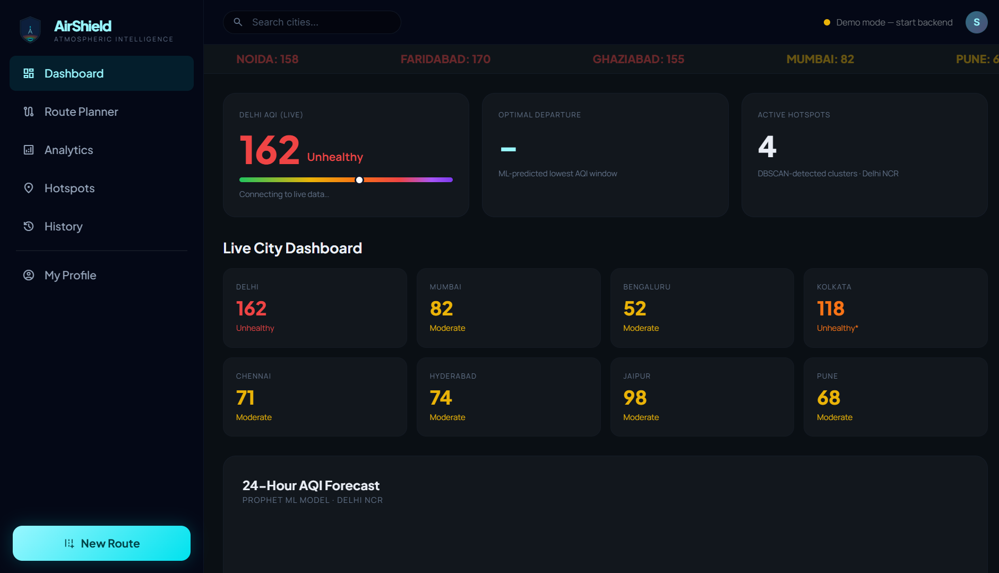
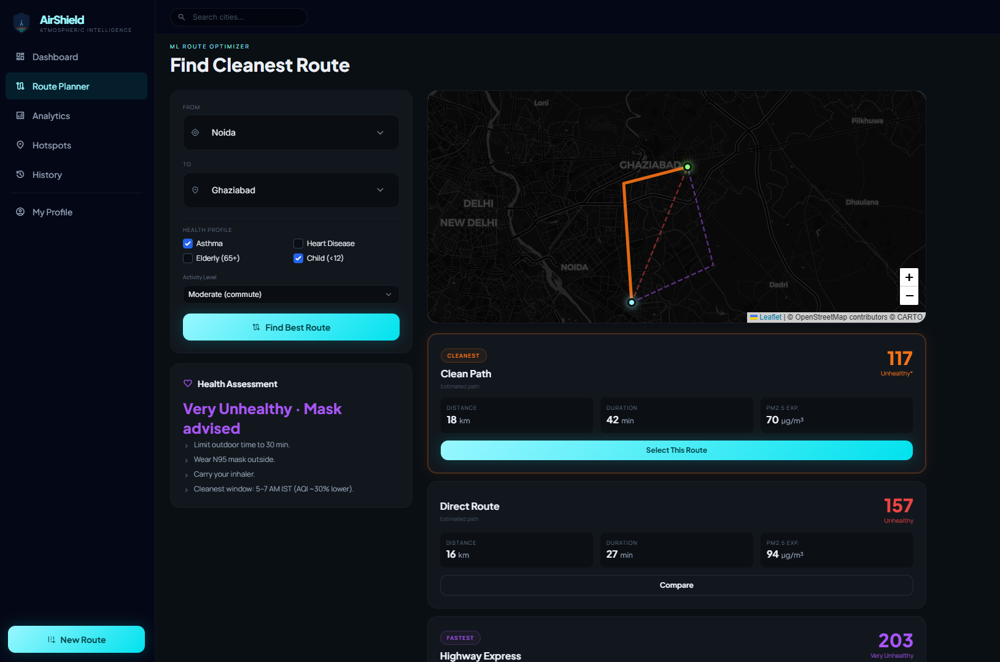
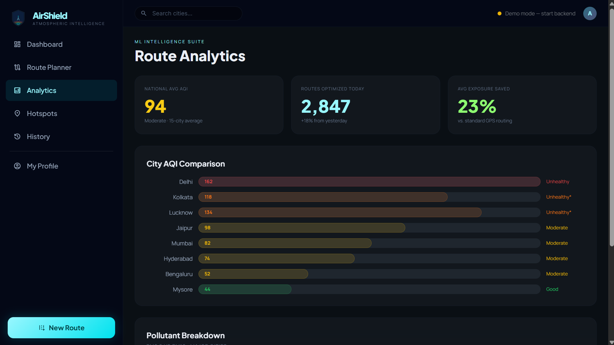
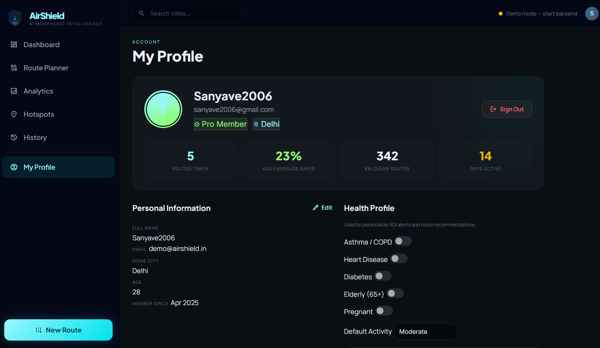

# AirShield Routes India 🛡️
### Atmospheric Intelligence Platform — Full Stack with ML
Live demo: https://sanya1205.github.io/AIRSHEILD/
A real-world air quality navigation system that uses ML to find the cleanest routes across Indian cities. Built with FastAPI + scikit-learn/Prophet on the backend and a vanilla JS/Leaflet frontend matching your original design system.
## 📸 Screenshots

### Dashboard


### Route Planner


### Analytics


### Profile


### Hotspots


---

## 🏗️ Architecture

```
airshield/
├── backend/                    # FastAPI ML Server
│   ├── main.py                 # App entry point, CORS, router registration
│   ├── requirements.txt
│   ├── start.sh               # One-command startup
│   ├── ml/
│   │   └── models.py          # All 4 ML models
│   └── routers/
│       ├── aqi.py             # AQI prediction endpoints
│       ├── routes.py          # Route optimization endpoints
│       ├── hotspots.py        # Hotspot detection endpoints
│       └── health.py          # Health alert endpoints
└── frontend/
    └── index.html             # Complete multi-page SPA
```

---

## 🤖 ML Features

### 1. AQI Forecasting (Prophet)
- **Model**: Facebook Prophet (time-series) with scikit-learn LinearRegression fallback
- **Endpoint**: `POST /api/aqi/forecast`
- **Output**: 24-hour AQI forecast with confidence intervals + optimal departure time
- **Training data**: CPCB/OpenAQ historical AQI per city

### 2. Route Optimization (Dijkstra + AQI weighting)
- **Model**: Graph algorithm weighted by `AQI × distance` (exposure score)
- **Endpoint**: `POST /api/routes/optimize`
- **Output**: 3 route alternatives (cleanest / balanced / fastest) with GeoJSON paths

### 3. Hotspot Detection (DBSCAN)
- **Model**: DBSCAN clustering on high-AQI sensor coordinates
- **Endpoint**: `GET /api/hotspots/{city}`
- **Output**: Pollution cluster polygons with center, radius, severity

### 4. Personalized Health Alerts
- **Model**: Rule-based engine with condition-specific risk multipliers
- **Endpoint**: `POST /api/health/assess`
- **Input**: AQI + health conditions (asthma, COPD, heart disease, etc.) + age + activity
- **Output**: Effective risk level, mask advisory, personalized recommendations

---

## 🚀 Quick Start

### Backend (FastAPI + ML)

```bash
cd backend
chmod +x start.sh
./start.sh
```

The script automatically:
1. Creates a Python virtualenv
2. Installs all dependencies (FastAPI, scikit-learn, Prophet, pandas)
3. Starts the server at `http://localhost:8000`

**API Explorer**: Open `http://localhost:8000/docs` for interactive Swagger UI.

### Frontend

Just open `frontend/index.html` in your browser — no build step needed.

> **Note**: The frontend works in Demo Mode even without the backend running. When the backend is live, it automatically switches to real ML predictions (shown in the top-right status indicator).

---

## 📡 API Reference

### AQI Endpoints
```
GET  /api/aqi/current/{city}          # Live AQI for a city
POST /api/aqi/forecast                # 24h ML forecast
     Body: { "city": "Delhi", "hours_ahead": 24 }
GET  /api/aqi/ticker                  # All cities live ticker
GET  /api/aqi/cities                  # Supported cities list
```

### Route Endpoints
```
POST /api/routes/optimize             # Find cleanest route
     Body: { "origin": "Delhi", "destination": "Gurgaon" }
GET  /api/routes/cities               # Supported cities
```

### Hotspot Endpoints
```
GET  /api/hotspots/{city}             # Detect pollution clusters
     ?aqi_threshold=120               # Optional AQI filter
```

### Health Endpoints
```
POST /api/health/assess               # Personalized risk assessment
     Body: {
       "aqi": 162,
       "conditions": ["asthma", "elderly"],
       "age": 68,
       "activity": "moderate"
     }
```

**Supported conditions**: `asthma`, `copd`, `heart_disease`, `diabetes`, `elderly`, `child`, `pregnant`, `healthy_adult`

---

## 🗺️ Real Data Integration

To connect real CPCB/OpenAQ data instead of the mock data:

### Option A: OpenAQ (Free, No Key Needed)
```python
# In routers/aqi.py, replace CITY_LIVE_AQI with:
import httpx
async def get_live_aqi(city: str) -> float:
    url = f"https://api.openaq.org/v2/latest?city={city}&country=IN&parameter=pm25&limit=1"
    async with httpx.AsyncClient() as client:
        r = await client.get(url)
        data = r.json()
        return data["results"][0]["measurements"][0]["value"] * 1.5  # pm25→AQI approx
```

### Option B: CPCB Data Feed
Register at https://app.cpcbccr.com/AQI_India/ for the official CPCB API key, then:
```python
CPCB_KEY = os.getenv("CPCB_API_KEY")  # in .env
```

### Option C: OpenWeather Air Pollution API (Free tier: 1000/day)
```python
OW_KEY = os.getenv("OPENWEATHER_KEY")
url = f"http://api.openweathermap.org/data/2.5/air_pollution?lat={lat}&lon={lon}&appid={OW_KEY}"
```

---

## 🌐 Deployment

### Backend: Render / Railway / Fly.io
```bash
# Dockerfile
FROM python:3.11-slim
WORKDIR /app
COPY backend/ .
RUN pip install -r requirements.txt
CMD ["uvicorn", "main:app", "--host", "0.0.0.0", "--port", "8000"]
```

### Frontend: Vercel / Netlify / GitHub Pages
Just deploy `frontend/index.html` — no build step required.

Update the `API` constant in `frontend/index.html`:
```javascript
const API = 'https://your-backend.onrender.com/api';
```

---

## 🔜 Next Steps

| Feature | Implementation |
|---|---|
| Real-time CPCB feed | Replace `CITY_LIVE_AQI` dict with OpenAQ API calls |
| OSRM routing | Replace mock waypoints with OSRM `/route/v1/driving/` |
| User accounts | Add Supabase/Firebase auth |
| Push notifications | Web Push API for AQI threshold alerts |
| Mobile app | React Native with same FastAPI backend |
| Model retraining | Cron job to retrain Prophet weekly on fresh data |

---

## 📦 Tech Stack

| Layer | Technology |
|---|---|
| Frontend | Vanilla JS + Tailwind CSS + Leaflet.js |
| Backend | FastAPI (Python 3.11) |
| AQI Forecasting | Prophet (Facebook) + scikit-learn fallback |
| Route Optimization | Custom Dijkstra with AQI weighting |
| Hotspot Detection | DBSCAN (scikit-learn) |
| Health Profiling | Rule engine with WHO AQI thresholds |
| Mapping | Leaflet.js + CartoDB Dark tiles |
| Charts | Pure CSS bar charts (no heavy lib needed) |
| Data sources | OpenAQ + CPCB + OpenWeather (free tiers) |

---

© 2025 AirShield Routes India. Atmospheric Intelligence.
